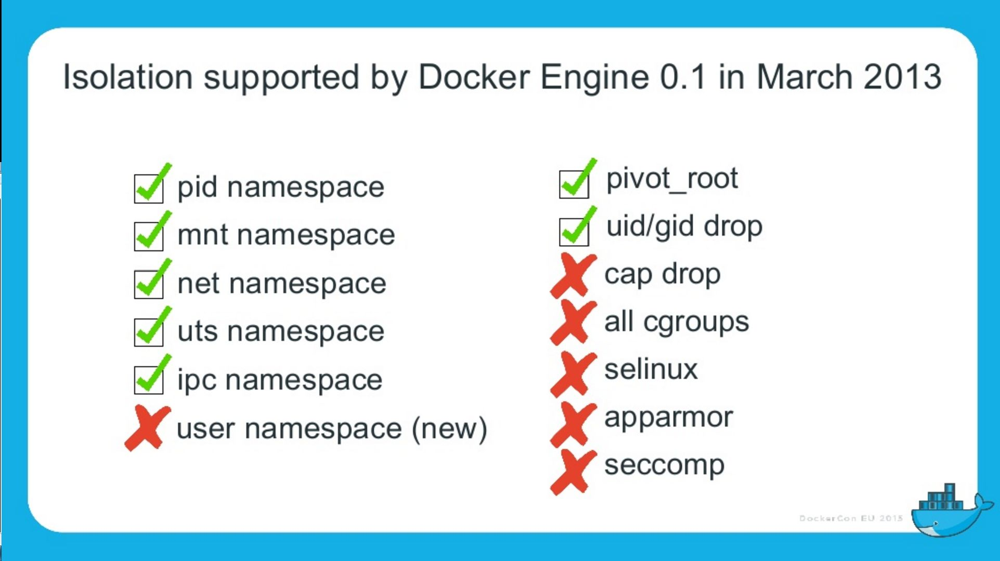

= Docker en Production ? Et la Sécurité ... ?
Jean-Marc Meessen
:backend: revealjs
:revealjs_theme: league
:revealjs_control: false
:revealjs_slideNumber: true

== Bonjour ==

[%step]
* Jean-Marc MEESSEN
* Bruxelles, Belgique
* "Brol Engineer" @ Worldline-BE
* (Development Infrastructure Expert)

== Et vous ? ==

[%step]
* developers ?
* Ops ?
* Securité ?
* Manager ?

[NOTE.speaker]
--
Actually things aren't that bad
--

== Et vous ? ==

[%step]
* expérience avec Docker ?
** jamais entendu parlé ?
** un peu expérimenté avec
** l'utilise tout les jours

// source: http://www.echecparadisfiscaux.ca/wp-content/uploads/2013/04/les-problemes.jpg
[data-background="images/problemes.jpg"]
== !

== Docker en production ?

Voilà en général la réaction...

== !

// Source: https://bobstechsite.com/wp-content/uploads/2013/12/d8a448abb3779dd23ea09d0d8ac2475b2aeb2687.jpg
image::images/panique.jpg[afraid,70%]

== Le problème ==

* La popularité de Docker est le reflet du désir de moins en moins de friction.
* Sa facilité d'utilisation fait qu'on néglige les vérifications et les compromis.

== !

Et pourtant la *Sécurité* est importante.

[NOTE.speaker]
--
Actually things aren't that bad
--

== Et pourquoi ? ==

* Nos clients nous confient leurs systèmes / leurs données.
* Il n'y a pas de sanctions pour les entreprises IT
** seulement un coût
** pas de principe "pollueur/payeur"

== !

J'estime que nous avons une responssabilité morale de rappeler les bonnes pratiques à nos managers.

== La situation de Docker

// source: http://www.it-wars.com/images/cloudcomputing/docker-security.jpg
image::images/docker_shark.jpg[docker_shark,80%]

== Rappel

// source: https://media.licdn.com/mpr/mpr/shrinknp_800_800/AAEAAQAAAAAAAAQzAAAAJDY1YTU3M2NkLTc3OTEtNGQ1My1iMDkyLTFmNDUzMzc5MmZjNQ.jpg
image::images/docker_overview.jpg[]

== Que cherche-t-il ?

// source: http://digitalhealthage.com/wp-content/uploads/2015/10/Dave-hacking-story.jpg
image::images/hacker.jpg[]

== Que cherche-t-il ?

* Des données
* Accéder à d'autres systèmes
* Élévation de privilège

// source: http://www.maxtechstore.com/images/treasure-chest.jpg
image:images/treasure.jpg[treasure,300]

== Les dangers avec Docker ?

[%step]
* Kernel exploits
* Denial of service attack
* Container breakout
* Poisoned images
* Compromising Secrets

[NOTE.speaker]
--
* Amplification.
* un container peut tout bloquer
* sortir
* Poisoned images
* access DB
--

== Est-ce que Docker est "secure" ?

* Beaucoup d'attentes, d'illusions
* "Silver bullet"
* positionement de concurents (VM, Configuration Mgt)
* jalousie

== Docker, Inc et la sécurité

* La Sécurité (= operabilité) est une de leur préocupation fondamentale
* Conscient de la jeunesse de la technologie
* Très réactifs
* Attitude positive sur l'approche

== !

image::images/docker_slide_1.jpg[]

== !

image::images/docker_slide_2.jpg[]

== !

== "Container do not contain !"

* perception erronée du "public"
* Progrès énormes en 3 ans
** mais utilisable...

[NOTE.speaker]
--
utiliser techno pour ce qu'elle est
préocupation initiale
(early adopters en prod): env mutualisé/cloud
--

== !

image::images/docker_overview.jpg[]

== !

[NOTE.speaker]
--
* PID renumérotation des process
--

== !

== !

image::images/docker_slide_6.jpg[]

== En particulier

* Cap drop
* User namespace
* selinux / apparmor

== Demo usernamespace

// source : http://techbeacon.com/sites/default/files/styles/article_main_image/public/9_0.jpg?itok=j6kSlRwH
[data-background="images/container_wall.jpg"]
== Des containers "propre" ?

== !

* contenus malveillants
* Softs buggés ou vulnérables

== Notary

== Nautilus

== Recommendations

// source: http://hygiene-plus.com/wp-content/uploads/2014/08/IPRP_prevention_risque_salon_coiffure_institut_beaute_2.jpg
image::images/prevention.jpg[prevention,550]
